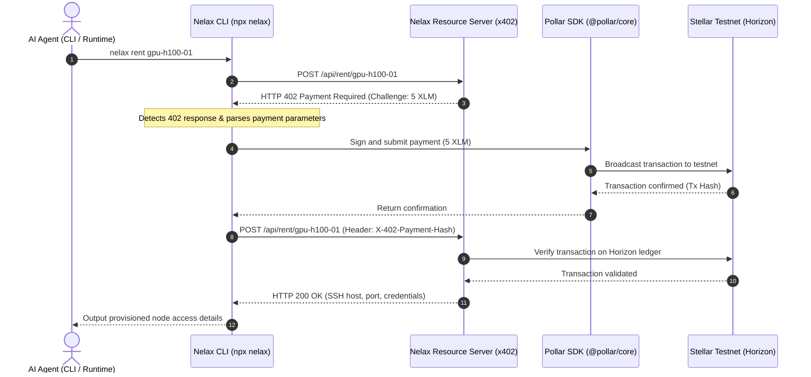
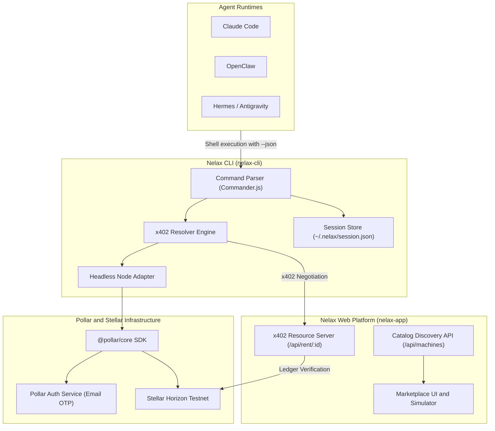

# Nelax: Autonomous AI Agent Wallets and x402 Compute Protocol on Stellar

**Track:** Build any app on Pollar  
**Event:** Pollar Hackathon: Build on Pollar (Boundless)  
**Live Application:** [https://nelax.nebulaz.xyz/](https://nelax.nebulaz.xyz/)  
**Live Compute Marketplace:** [https://nelax.nebulaz.xyz/marketplace](https://nelax.nebulaz.xyz/marketplace)  
**Agent Onboarding Guide:** [https://nelax.nebulaz.xyz/onboarding](https://nelax.nebulaz.xyz/onboarding)  
**npm Registry:** [`nelax-cli` on npm](https://www.npmjs.com/package/nelax-cli) (`npx -y nelax-cli discover`)  

---

## 1. Executive Summary

Nelax is financial and resource-provisioning infrastructure built specifically for autonomous AI agents. Powered by Pollar and deployed on the Stellar Testnet, Nelax allows AI agents (Claude Code, OpenClaw, Hermes, Antigravity, and autonomous subagents) to create and control non-custodial Stellar wallets, receive funds, and autonomously lease GPU/cloud compute clusters or access paywalled APIs via the x402 Payment-Required protocol.

Traditional crypto wallets and payment flows require browser extensions, mobile touchscreens, and manual OTP authorization. When autonomous agents operate in terminal environments, they hit a hard wall: they cannot swipe credit cards or approve wallet popups.

Nelax solves this by delivering:
- A headless terminal CLI tool (`nelax-cli` on npm) with machine-readable JSON outputs.
- Autonomous x402 HTTP challenge resolution, converting HTTP 402 responses into on-chain Stellar transactions.
- A live compute marketplace dashboard featuring real-time cluster telemetry and on-chain verification links.
- Standardized agent skills (`SKILL.md`) enabling seamless integration into leading AI agent frameworks.

---

## 2. Architecture and Interaction Flow

The following sequence illustrates how an autonomous agent uses Nelax to resolve an HTTP 402 challenge, settle payment via Pollar on the Stellar Testnet, and unlock compute credentials without human input.



### System Component Architecture



---

## 3. Proof of On-Chain Transactions via Pollar

Nelax settles all compute rentals and direct transfers on the Stellar Testnet through Pollar. Below are real on-chain payment transactions executed by our CLI and verified on Horizon and Stellar Expert:

- **Provider Wallet Address:** `GCWDVYVPM7ORTD5INWSP3C5TRV5TRBEIHZWY3K4HS3STLKJE5I7OSMVB`
- **Account Explorer:** [View on Stellar Expert](https://stellar.expert/explorer/testnet/account/GCWDVYVPM7ORTD5INWSP3C5TRV5TRBEIHZWY3K4HS3STLKJE5I7OSMVB)
- **Pollar App Client Key:** `pub_testnet_077431599670fb80328d36889d95f721`

| Transaction Hash | Amount | Resource / Action | Explorer Link |
|---|---|---|---|
| `05c42043f3cf51bd771e49d79caf20347a4a8961d6b9820433a766eb1fd093df` | 1.0 XLM | RTX 4090 Node Lease | [View Tx](https://stellar.expert/explorer/testnet/tx/05c42043f3cf51bd771e49d79caf20347a4a8961d6b9820433a766eb1fd093df) |
| `8862ffd36572622fb291d3181896b89a7143b179d5445313dead6bb78e4afe20` | 1.0 XLM | RTX 4090 Node Lease | [View Tx](https://stellar.expert/explorer/testnet/tx/8862ffd36572622fb291d3181896b89a7143b179d5445313dead6bb78e4afe20) |
| `98cddc653871c79cf2373578e18396c77714975a651c0f1a5ccc04afb163ef86` | 20.0 XLM | H100 Cluster Lease | [View Tx](https://stellar.expert/explorer/testnet/tx/98cddc653871c79cf2373578e18396c77714975a651c0f1a5ccc04afb163ef86) |
| `c8b5f729a3b7f1c7b8b36e9223ca917bb58c4d2ab2c525c1302591ecf3a40c30` | 1.0 XLM | Direct Micro-transfer | [View Tx](https://stellar.expert/explorer/testnet/tx/c8b5f729a3b7f1c7b8b36e9223ca917bb58c4d2ab2c525c1302591ecf3a40c30) |
| `5eb109dfd0ad6ab37bf82fa977ffc123fd3e8f05b1dcfbd2c0c7c344b1cf8c69` | 20.0 XLM | H100 Compute Lease | [View Tx](https://stellar.expert/explorer/testnet/tx/5eb109dfd0ad6ab37bf82fa977ffc123fd3e8f05b1dcfbd2c0c7c344b1cf8c69) |

---

## 4. Repository Structure

```
Nelax/
├── README.md               # Hackathon submission documentation
├── SKILL.md                # Standardized Agent Skill specification
├── PLAN_CLI.md             # Technical design for nelax-cli
├── PLAN_COMPUTE.md         # Technical design for x402 marketplace routes
│
├── nelax-cli/              # TypeScript CLI tool (published as nelax-cli on npm)
│   ├── src/
│   │   ├── index.ts        # CLI command routing and help formatter
│   │   ├── pollar.ts       # Headless @pollar/core adapter with Node polyfills
│   │   ├── x402.ts         # Autonomous HTTP 402 negotiation client
│   │   ├── session.ts      # Persistent session manager (~/.nelax/session.json)
│   │   └── types.ts        # Shared TypeScript interfaces
│   ├── package.json        # Binary metadata and scripts
│   └── tsup.config.ts      # Binary build configuration
│
└── nelax-app/              # Next.js 16 Web Application
    ├── app/
    │   ├── page.tsx        # Landing page with animated WebGL shader
    │   ├── marketplace/    # Live Compute Marketplace UI and x402 simulator
    │   ├── onboarding/     # Step-by-step agent and developer setup guide
    │   ├── dashboard/      # Agent spending guardrails and wallet monitor
    │   └── api/
    │       ├── machines/   # GET /api/machines (catalog discovery)
    │       ├── rent/[id]/  # POST/GET/DELETE /api/rent/[id] (x402 server)
    │       └── wallet/     # GET /api/wallet (Stellar Horizon balance proxy)
    └── lib/
        └── compute-store.ts # In-memory cluster inventory and transaction log
```

---

## 5. CLI Command Reference

The CLI is executable without installation via `npx -y nelax-cli <command>`. Every command supports `--json` for direct parsing by agent frameworks.

### Global Options
- `-v, --version`: Output the current version of the CLI.
- `-h, --help`: Display command usage and agent tips.

### Commands

#### 1. Authentication and Activation
```bash
# Request email OTP code
nelax login agent@example.com

# Verify code, deploy non-custodial Stellar wallet, and save session
nelax verify 123456

# Verify with structured output for agents
nelax verify 123456 --json
```

#### 2. Wallet and Balance Inspection
```bash
# Human-readable view
nelax wallet

# Machine-readable JSON output
nelax wallet --json
```
Output Schema:
```json
{
  "address": "GCWDVYVPM7ORTD5INWSP3C5TRV5TRBEIHZWY3K4HS3STLKJE5I7OSMVB",
  "network": "testnet",
  "balances": [
    {
      "asset": "XLM",
      "balance": "9958.9999500",
      "isNative": true
    }
  ],
  "explorerUrl": "https://stellar.expert/explorer/testnet/account/GCWDVYVPM7ORTD5INWSP3C5TRV5TRBEIHZWY3K4HS3STLKJE5I7OSMVB"
}
```

#### 3. Stellar Testnet Friendbot Funding
```bash
# Top up the active wallet with 10,000 testnet XLM
nelax fund

# Fund a specific address
nelax fund GCWDVYVPM7ORTD5INWSP3C5TRV5TRBEIHZWY3K4HS3STLKJE5I7OSMVB
```

#### 4. Compute Discovery
```bash
# View available nodes in cluster
nelax discover

# Filter only unleased nodes with JSON format
nelax discover --available --json
```

#### 5. Autonomous Compute Rental (x402)
```bash
# Automatically negotiates 402 challenge, pays on-chain, and prints credentials
nelax rent gpu-h100-01

# Structured credentials for direct agent consumption
nelax rent gpu-h100-01 --json
```
Provisioned Output:
```json
{
  "machineId": "gpu-h100-01",
  "name": "NVIDIA H100 80GB SXM5",
  "ip": "138.199.36.42",
  "sshPort": 2222,
  "username": "agent-nelax",
  "authToken": "lease_sec_99a81f...",
  "leaseExpiresAt": "2026-09-18T15:15:00.000Z",
  "txHash": "05c42043f3cf51bd771e49d79caf20347a4a8961d6b9820433a766eb1fd093df",
  "sshCommand": "ssh -p 2222 agent-nelax@138.199.36.42"
}
```

#### 6. Direct Payment and Ledger History
```bash
# Send testnet funds directly
nelax pay GCWDVYVPM7ORTD5INWSP3C5TRV5TRBEIHZWY3K4HS3STLKJE5I7OSMVB 1.5 XLM

# Fetch recent transaction history
nelax history --limit 5
```

#### 7. Session Teardown
```bash
# Clear local credentials and session
nelax logout
```

---

## 6. The x402 Protocol Specification

The x402 protocol enables machine-to-machine commerce over standard HTTP.

1. **Initial Access Attempt:** The agent sends a `POST` or `GET` request to a protected resource (e.g. `/api/rent/gpu-h100-01`).
2. **Challenge Response:** If no payment proof is present, the server responds with:
   - Status: `402 Payment Required`
   - Header: `WWW-Authenticate: X-402 destination="<StellarAddress>", amount="5.0", asset="XLM", network="stellar:testnet"`
   - Body: JSON challenge containing payment instructions and hardware specs.
3. **Settlement:** The client uses Pollar to build, sign, and submit the required transaction to the Stellar Testnet ledger.
4. **Retry with Proof:** The client re-executes the original request with:
   - Header: `X-402-Payment-Hash: <transaction_hash>`
   - Header: `Authorization: x402 <transaction_hash>`
5. **Ledger Verification & Unlocking:** The server queries Stellar Horizon, validates that the transaction succeeded and transferred the expected amount, records the lease, and returns the unlocked payload with HTTP `200 OK`.

---

## 7. Key Engineering Challenges and Solutions

### Headless Execution of @pollar/core
The `@pollar/core` SDK is primarily designed for client-side browser runtimes and references browser globals (`window`, `localStorage`, `addEventListener`, and CORS Origin policies). When executed by an AI agent inside a Node.js shell, these dependencies fail.

**Solution:** In `nelax-cli/src/pollar.ts`, we implemented a lightweight browser polyfill layer that provides in-memory storage, intercepts `fetch` to attach valid `Origin` headers required by Pollar's API gateway, and suppresses browser-only console warnings. This enables 100% headless operation inside terminal runtimes.

### Machine-Readable Error Recovery
Language model agents cannot interpret vague terminal strings. When an on-chain transaction fails or a balance is insufficient, standard CLI tools print decorative text that confuses the agent.

**Solution:** Nelax implements structured JSON error envelopes with explicit recovery hints (such as pointing the agent to `nelax fund` when balances are low or clarifying OTP verification stages).

---

## 8. Tech Stack

- **Wallet Infrastructure:** Pollar (`@pollar/core`)
- **Blockchain Network:** Stellar Testnet (`stellar:testnet`), Horizon REST API, Stellar Expert
- **CLI Development:** TypeScript, Node.js, Commander.js, Chalk, Ora, Conf, tsup
- **Web Application:** Next.js 16 (App Router), React 19, Tailwind CSS v4, Lucide React
- **Agent Integration:** Standard Agent Skill protocol (`SKILL.md`)

---

## 9. License

This project is licensed under the MIT License.
